# Estructura del Proyecto

Este diagrama representa la estructura de carpetas propuesta para el proyecto, con una clara separación entre frontend, backend y servicios de integración.

```mermaid
graph TD
    Root[Project Root] --> README.md
    Root --> package.json
    Root --> .gitignore
    Root --> Frontend[frontend/]
    Root --> Backend[backend/]
    Root --> Integration[integracion/]
    Root --> Docs[docs/]
    Root --> Tests[tests/]
    
    %% Frontend structure
    Frontend --> FrontSrc[src/]
    FrontSrc --> FrontComponents[components/]
    FrontSrc --> FrontPages[pages/]
    FrontSrc --> FrontAssets[assets/]
    FrontSrc --> FrontUtils[utils/]
    FrontSrc --> FrontStyles[styles/]
    Frontend --> FrontPublic[public/]
    Frontend --> FrontConfig[config/]
    Frontend --> FrontPackage[package.json]
    
    %% Backend structure
    Backend --> BackSrc[src/]
    BackSrc --> BackControllers[controllers/]
    BackSrc --> BackModels[models/]
    BackSrc --> BackRoutes[routes/]
    BackSrc --> BackMiddleware[middleware/]
    BackSrc --> BackUtils[utils/]
    BackSrc --> BackConfig[config/]
    Backend --> BackPackage[package.json]
    Backend --> BackTests[tests/]
    
    %% Integration structure
    Integration --> IntSrc[src/]
    IntSrc --> IntConnectors[connectors/]
    IntSrc --> IntAdapters[adapters/]
    IntSrc --> IntTransformers[transformers/]
    IntSrc --> IntUtils[utils/]
    Integration --> IntConfig[config/]
    Integration --> IntPackage[package.json]
    
    %% Docs structure
    Docs --> DocsApi[api/]
    Docs --> DocsArchitecture[architecture/]
    Docs --> DocsDeployment[deployment/]
    
    %% Tests structure
    Tests --> TestsUnit[unit/]
    Tests --> TestsIntegration[integration/]
    Tests --> TestsE2E[e2e/]
```



## Detalles de la estructura

### Carpetas principales
- **frontend/**: Contiene todos los componentes y recursos del cliente
- **backend/**: Alberga la lógica del servidor y API
- **integracion/**: Servicios para comunicación con sistemas externos
- **docs/**: Documentación técnica y de usuario
- **tests/**: Pruebas compartidas entre componentes

### Características de la estructura
- **Claridad**: Nombres descriptivos y organización lógica
- **Escalabilidad**: Permite añadir nuevos módulos sin reestructurar
- **Separación de responsabilidades**: Componentes aislados con funciones específicas

## Estructura de Carpetas en Formato Tradicional

```
project-root/
│
├── README.md
├── package.json
├── .gitignore
│
├── frontend/
│   ├── src/
│   │   ├── components/
│   │   ├── pages/
│   │   ├── assets/
│   │   ├── utils/
│   │   └── styles/
│   ├── public/
│   ├── config/
│   └── package.json
│
├── backend/
│   ├── src/
│   │   ├── controllers/
│   │   ├── models/
│   │   ├── routes/
│   │   ├── middleware/
│   │   ├── utils/
│   │   └── config/
│   ├── tests/
│   └── package.json
│
├── integracion/
│   ├── src/
│   │   ├── connectors/
│   │   ├── adapters/
│   │   ├── transformers/
│   │   └── utils/
│   ├── config/
│   └── package.json
│
├── docs/
│   ├── api/
│   ├── architecture/
│   └── deployment/
│
└── tests/
    ├── unit/
    ├── integration/
    └── e2e/
```

Esta representación visual tradicional complementa el diagrama de Mermaid, mostrando claramente la jerarquía de carpetas y archivos en un formato familiar tipo árbol de directorios.
