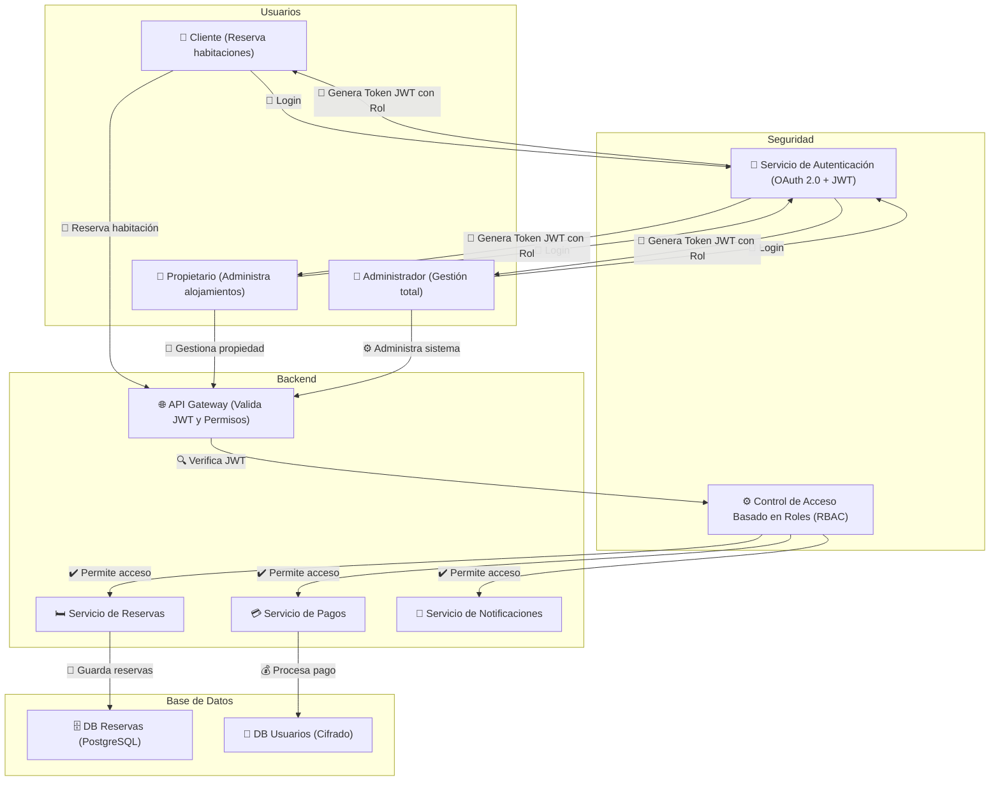
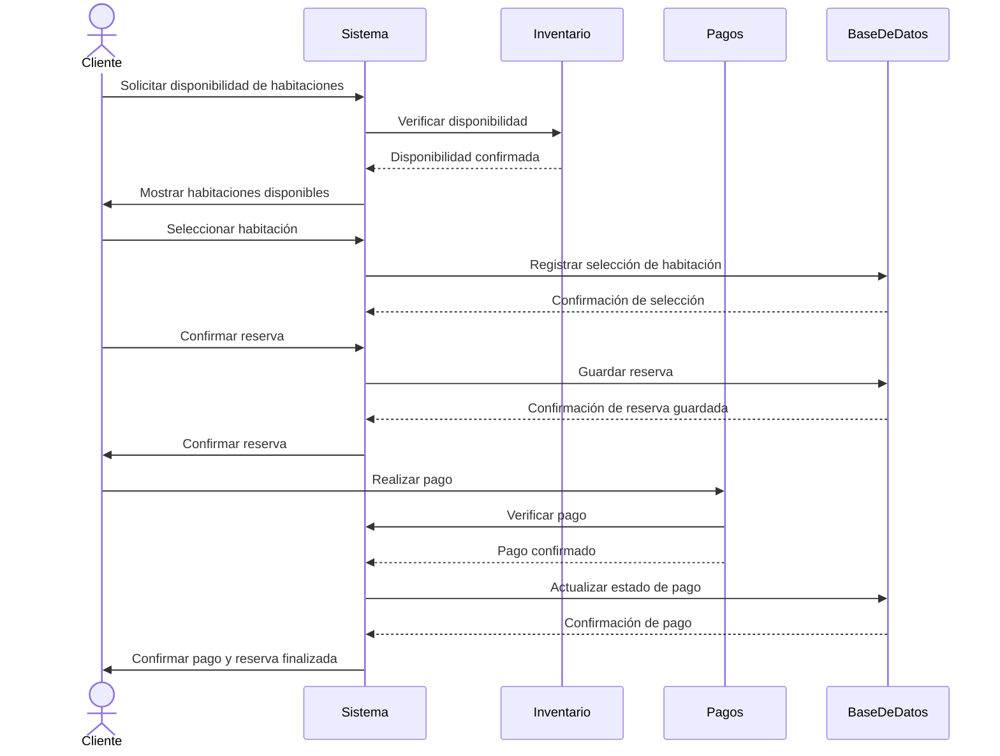

Paso 1: Investigación Preliminar
Prompt:    "Toma el rol de experto en arquitectura de software y asesórame en una investigación:

Comprender el funcionamiento básico:
Investiga cómo funcionan los sistemas de reservación de habitaciones. Revisa ejemplos de sistemas existentes y sus características."

Respuesta: "Los sistemas de reservación de habitaciones son plataformas tecnológicas diseñadas para gestionar la disponibilidad, precios y reservas de habitaciones en hoteles, hostales y propiedades de alquiler. Estos sistemas pueden operar de manera independiente o estar integrados con otros sistemas, como motores de búsqueda, agencias de viajes en línea (OTA, como Booking.com o Expedia) y sistemas de gestión hotelera (PMS, Property Management System).  

---

### **Funcionamiento Básico**  
Un sistema de reservación de habitaciones generalmente sigue este flujo de trabajo:  

1. **Búsqueda de disponibilidad:**  
   - El usuario ingresa fechas y preferencias (número de huéspedes, tipo de habitación).  
   - El sistema consulta la base de datos para verificar disponibilidad en tiempo real.  
   - Se presentan opciones con detalles de precios, políticas de cancelación y servicios incluidos.  

2. **Selección y configuración de la reserva:**  
   - El usuario elige una habitación y, en algunos casos, selecciona servicios adicionales.  
   - Se calcula el precio final con impuestos y tarifas adicionales.  

3. **Ingreso de datos del huésped:**  
   - Se recopilan datos personales y preferencias especiales.  
   - Se verifica la identidad y, en algunos casos, se requiere la creación de una cuenta.  

4. **Procesamiento del pago:**  
   - Se integra un sistema de pagos que puede soportar tarjetas de crédito/débito, transferencias o pasarelas como PayPal o Stripe.  
   - Puede existir un modelo de pago completo, pago parcial o solo garantía de reserva con pago en el hotel.  

5. **Confirmación y generación de documento:**  
   - Se genera un código de reserva único.  
   - Se envía un correo de confirmación con detalles de la estancia.  
   - El sistema actualiza la disponibilidad en la base de datos.  

6. **Gestión de cambios y cancelaciones:**  
   - El usuario puede modificar fechas, agregar servicios o cancelar la reserva, sujeto a políticas establecidas.  

---

### **Ejemplos de Sistemas Existentes**  

1. **Sistemas de gestión propios (First-Party)**  
   - **Marriott Bonvoy**: Plataforma interna de Marriott, conectada a su sistema de lealtad y PMS.  
   - **Hilton Honors**: Integra reservas directas con beneficios para clientes frecuentes.  

2. **Motores de reserva de terceros (Third-Party Booking Engines)**  
   - **SiteMinder**: Se conecta a múltiples canales y actualiza la disponibilidad en tiempo real.  
   - **Cloudbeds**: Ofrece integración con OTA y PMS para hoteles pequeños y medianos.  

3. **Agencias de viajes en línea (OTAs)**  
   - **Booking.com**: Agrega disponibilidad de múltiples hoteles y permite reservas inmediatas.  
   - **Expedia**: Integra vuelos y paquetes con hospedaje.  

4. **Sistemas de gestión hotelera (PMS) con reservas integradas**  
   - **Opera PMS (Oracle)**: Utilizado por grandes cadenas hoteleras.  
   - **Mews**: PMS basado en la nube con automatización para hoteles independientes.  

---

### **Características Clave de los Sistemas de Reservación**  

- **Gestión de disponibilidad en tiempo real** (evita overbooking).  
- **Integración con canales de distribución** (OTA, metabuscadores como Google Hotels).  
- **Automatización de precios dinámicos** (revenue management).  
- **Soporte para múltiples métodos de pago y monedas.**  
- **Seguridad y cumplimiento normativo** (PCI-DSS para pagos, GDPR para datos personales).  

Si buscas algo más específico, dime en qué área necesitas más profundidad. 🚀"

nuevo prompt: "Si deseo que me recomiendes la mejor opción de arquitectura para una nueva aplicación de software para que sea: 
Correcta: Funcionan como se espera y cumplen con los requisitos del usuario.
Eficiente: Utilizan los recursos del sistema de manera óptima.
Escalable: Pueden crecer y adaptarse a nuevas necesidades sin problemas.
Fácil de mantener: Se pueden modificar y corregir errores con facilidad."

Respuesta: "Para una arquitectura de software que cumpla con estos criterios, te recomiendo una arquitectura de microservicios. Esta arquitectura divide la aplicación en pequeños servicios independientes que se comunican entre sí. Esto permite escalabilidad, mantenibilidad y flexibilidad. Además, permite que cada servicio se desarrolle, despliegue y mantenga de manera independiente, lo que facilita la corrección de errores y la adaptación a cambios." (texto generardo por ChatGPT autocompletado)

Respuesta CHATGPT: "Para una nueva aplicación de software de reservación de habitaciones que sea **correcta, eficiente, escalable y fácil de mantener**, recomiendo una **arquitectura basada en microservicios en la nube con una API centralizada y frontend desacoplado**.  

---

## **📌 Arquitectura Recomendada**
**Modelo: Microservicios en la Nube + API Gateway + Frontend desacoplado**  
💡 **Tecnologías clave:** Node.js, Python (FastAPI/Django), Go o Java (Spring Boot) para backend; React, Vue o Angular para frontend; PostgreSQL o MongoDB para la base de datos.  

---

### **🔹 Componentes Principales**

1️⃣ **Frontend (Cliente Web & Móvil) - SPA/PWA**  
   - Aplicación web (React/Vue/Angular) y/o móvil (Flutter/React Native) consumiendo la API.  
   - Puede usar **SSR** (Next.js/Nuxt.js) para mejorar rendimiento en búsquedas.  

2️⃣ **API Gateway** (NGINX, Kong, Apigee)  
   - Centraliza las peticiones y enruta a los microservicios correspondientes.  
   - Implementa autenticación (OAuth2, JWT) y control de acceso.  

3️⃣ **Microservicios del Backend (REST o GraphQL)**  
   - **Servicio de Reservas**: Manejo de habitaciones, disponibilidad, bloqueo y cancelaciones.  
   - **Servicio de Usuarios**: Registro, autenticación, perfiles.  
   - **Servicio de Pagos**: Integración con Stripe, PayPal, MercadoPago.  
   - **Servicio de Notificaciones**: Envío de correos/SMS/WhatsApp.  
   - **Servicio de Reportes y Análisis**: Análisis de ocupación, ingresos, tendencias.  

4️⃣ **Base de Datos (SQL + NoSQL)**  
   - **PostgreSQL/MySQL** para transacciones estructuradas (reservas, usuarios).  
   - **MongoDB/Redis** para caché y consultas rápidas (búsquedas).  
   - **ElasticSearch** para búsquedas avanzadas.  

5️⃣ **Infraestructura en la Nube** (AWS, GCP, Azure)  
   - Contenedores en **Docker + Kubernetes** para escalar automáticamente.  
   - **AWS Lambda / Cloud Functions** para tareas asincrónicas.  
   - **CDN (CloudFront, Cloudflare)** para acelerar el frontend.  
   - **Cola de Mensajes (RabbitMQ, Kafka, SQS)** para eventos internos.  

---

### **🎯 Ventajas de esta Arquitectura**
✅ **Correcta:** Servicios desacoplados que cumplen cada función sin afectar otras partes del sistema.  
✅ **Eficiente:** Uso de caché, bases optimizadas y escalado automático.  
✅ **Escalable:** Kubernetes y API Gateway facilitan el crecimiento sin afectar el rendimiento.  
✅ **Fácil de mantener:** Microservicios independientes permiten actualizaciones sin romper todo el sistema.  

---

### **📌 Alternativas más simples (Si no necesitas microservicios aún)**
Si prefieres empezar más rápido, puedes usar un **monolito modular** con **Django + DRF o Laravel** en un servidor escalable (AWS ECS o Heroku) y luego migrar a microservicios cuando crezca la demanda.  

💡 **Conclusión:** Si buscas escalabilidad desde el día 1, ve con microservicios. Si solo estás validando el modelo de negocio, inicia con un monolito bien estructurado. 🚀  

¿Qué opción te interesa más? 😊"


prompt: "Ok, ahora necesito: Identificar componentes y actores:
Haz una lista de los componentes clave (por ejemplo, motor de búsqueda, sistema de reservas, procesamiento de pagos, etc.).
Identifica los actores involucrados (usuarios, administradores, proveedores de servicios de pago, etc.)."


Respuesta: "### **📌 Componentes Clave y Actores en un Sistema de Reservación de Habitaciones**  

Para estructurar bien la arquitectura, es clave **identificar los componentes principales** y **los actores que interactúan con el sistema**.  

---

## **🔹 1. Componentes Clave**
Estos son los módulos esenciales del sistema:  

### **🖥️ Frontend (Interfaz de Usuario)**
📌 **Descripción:** Aplicación web y móvil que permite a los usuarios interactuar con el sistema.  
🔹 **Tecnologías:** React/Vue/Angular (Web), Flutter/React Native (Móvil).  
🔹 **Funciones clave:**  
   - Búsqueda de habitaciones.  
   - Gestión de reservas.  
   - Perfil del usuario.  
   - Pagos y facturación.  
   - Notificaciones y confirmaciones.  

---

### **🛠 Backend (Servicios y Lógica de Negocio)**
📌 **Descripción:** Conjunto de microservicios que gestionan la lógica del sistema.  
🔹 **Servicios clave:**  

1️⃣ **Servicio de Búsqueda de Disponibilidad**  
   - Consulta habitaciones disponibles en tiempo real.  
   - Optimiza búsquedas con caché (Redis).  

2️⃣ **Servicio de Reservas**  
   - Gestiona la creación, modificación y cancelación de reservas.  
   - Bloqueo de habitaciones para evitar overbooking.  

3️⃣ **Servicio de Usuarios y Autenticación**  
   - Manejo de perfiles (huéspedes, administradores, staff).  
   - Seguridad con OAuth2, JWT.  

4️⃣ **Servicio de Pagos**  
   - Integración con **Stripe, PayPal, MercadoPago**.  
   - Validación de transacciones y generación de facturas.  

5️⃣ **Servicio de Notificaciones**  
   - Envío de correos, SMS o WhatsApp con confirmaciones y recordatorios.  

6️⃣ **Servicio de Reportes y Analytics**  
   - Análisis de ocupación, ingresos y cancelaciones.  
   - Dashboard para administradores.  

---

### **🗄️ Base de Datos y Almacenamiento**
📌 **Descripción:** Manejo de datos estructurados y no estructurados.  
🔹 **Tecnologías:** PostgreSQL/MySQL (relacional), MongoDB (documentos), Redis (caché).  
🔹 **Estructura de datos clave:**  
   - **Reservas:** ID, usuario, fechas, habitación, estado.  
   - **Usuarios:** Nombre, email, rol, historial de reservas.  
   - **Pagos:** ID, monto, método, estado.  
   - **Habitaciones:** ID, tipo, precio, disponibilidad.  

---

### **🔹 2. Actores Involucrados**
Estos son los principales usuarios y sistemas que interactúan con el software.  

1️⃣ **Huéspedes (Usuarios Finales)**  
   - Buscan y reservan habitaciones.  
   - Realizan pagos.  
   - Reciben notificaciones.  

2️⃣ **Administradores del Hotel**  
   - Gestionan habitaciones y disponibilidad.  
   - Manejan tarifas y promociones.  
   - Revisan reportes y métricas.  

3️⃣ **Personal del Hotel (Recepción, Limpieza, Mantenimiento)**  
   - Consulta reservas y check-ins.  
   - Recibe alertas de nuevas reservas.  

4️⃣ **Proveedores de Pago (Stripe, PayPal, MercadoPago, etc.)**  
   - Procesan transacciones y validan pagos.  

5️⃣ **Sistema de Facturación y Contabilidad**  
   - Genera facturas electrónicas para cada reserva.  

6️⃣ **Sistemas de Terceros (OTAs, Google Hotels, Booking.com, etc.)**  
   - Sincronización de disponibilidad y precios.  
   - Canal de distribución de reservas.  

---

💡 **Conclusión:**  
El sistema tiene **múltiples componentes** que deben comunicarse de manera eficiente. Ahora podemos definir cómo estos interactúan en un **diagrama de arquitectura** o detallar **las APIs necesarias**.  

¿Qué necesitas ahora? 🚀"            

Paso 2: Generación de Diagramas con IA

prompt: "Muy bien, ahora necesito generar diagramas para visualizar la información de forma gráfica: 
Diagrama de Arquitectura de Software en Mermaid:

Crear un diagrama que visualice los componentes del sistema y sus interacciones. 
Asegúrate de incluir servicios como el motor de búsqueda, gestión de reservas, procesamiento de pagos, notificaciones y administración de disponibilidad.

PASO 1: recomendame cual el mejor tipo de diagrama para visualizar este tipo de información, que tipo de restricciones debería tener y dame un ejemplo de código que podría utilizar.  "

Respuesta: "
### **📌 Descripción del Comportamiento a Modelar:**  
El sistema permite a los usuarios reservar habitaciones en línea con control de acceso basado en roles (**RBAC**).  
Cada usuario tiene un rol específico (**Cliente, Propietario, Administrador**) y su acceso está restringido según sus permisos.  
El sistema debe incluir:  
- **Autenticación y autorización segura** (OAuth 2.0 + JWT).  
- **Procesamiento de pagos** con integración a proveedores externos.  
- **Notificaciones** para confirmar reservas.  
- **Gestión de usuarios y control de acceso** a los servicios.  

---

### **📌 Diagrama Deseado:**  
- **Tipo:** **Diagrama de Arquitectura de Software** en Mermaid.  
- **Objetivo:** Visualizar **la interacción entre los usuarios, el backend y la infraestructura de seguridad**, asegurando una **comprensión clara de la autenticación, autorización y flujos clave**.  

---

### **📌 Restricciones:**  
✅ **Claridad y accesibilidad:** Evitar sobrecargar el diagrama con detalles técnicos innecesarios.  
✅ **Seguridad:** Incluir autenticación con **JWT** y control de acceso basado en roles (**RBAC**).  
✅ **Interacciones clave:** Mostrar **usuarios, API Gateway, microservicios y base de datos**.  
✅ **Flujos principales:** Enfocarse en **autenticación, reservas y pagos**.  

---

### **📌 Ejemplo de Código:**  



---

### **📌 Salida Esperada:**  
✅ Un **diagrama Mermaid claro y accesible** que ilustre:  
- **Usuarios y sus roles (Cliente, Propietario, Administrador)** con sus permisos.  
- **Flujo de autenticación** con generación de **tokens JWT**.  
- **API Gateway** como punto de validación de accesos.  
- **Microservicios principales** (reservas, pagos, notificaciones).  
- **Bases de datos separadas** (reservas en PostgreSQL y usuarios cifrados).  
---"

Respuesta:  Se generó el diagrama disponible en el archivo C:\Users\ddacq\Desktop\CAP03_CHALLENGE_V1\diagrams\Diagram1.md

Hasta aquí usé el modelo GPT-4o ahora voy a usar el modelo GPT-4o-mini

prompt: "Bien, ahora necesito: Diagrama UML de Componentes:

Desarrolla un diagrama UML que muestre los componentes del sistema y sus relaciones.
Destaca la comunicación entre módulos como autenticación de usuarios, servicio de inventario y sistemas externos. debo completar nuevamente la base de:

## Descripción del comportamiento a modelar:
Describe en detalle el comportamiento que deseas modelar

## Diagrama deseado:
Especifica el tipo de diagrama: Entidad-Relación, Secuencia, otros

## Restricciones:
Menciona cualquier limitación o condición que deba cumplir el diagrama

## Ejemplo de código:
Proporciona un fragmento de código similar al que deseas generar

## Salida esperada:
Utiliza Mermaid para diseñar el comportamiento."

Respuesta: "Aquí tienes el formato adaptado para tu nueva solicitud, con el enfoque en un **diagrama UML de componentes** que muestra las interacciones clave en tu sistema:

---

### **📌 Descripción del Comportamiento a Modelar:**  
El sistema debe permitir a los usuarios reservar habitaciones en línea con un control de acceso basado en roles (RBAC). Se debe asegurar una **autenticación de usuarios**, un **servicio de inventario** para la gestión de habitaciones y **comunicación con sistemas externos** (por ejemplo, proveedores de pagos). La interacción entre estos módulos debe ser claramente representada para garantizar la correcta comunicación entre ellos.

---

### **📌 Diagrama Deseado:**  
- **Tipo:** **Diagrama UML de Componentes**  
- **Objetivo:** Visualizar cómo los componentes del sistema se comunican entre sí, destacando los módulos de autenticación de usuarios, servicio de inventario, y los sistemas externos (como el de pagos y notificaciones).  

---

### **📌 Restricciones:**  
✅ **Claridad en las relaciones entre los componentes.**  
✅ **El diagrama debe enfocarse en los componentes principales (autenticación, inventario, pagos) y sus interacciones.**  
✅ **No debe incluir detalles de implementación específicos, sino más bien las relaciones y dependencias entre los componentes.**  
✅ **El diagrama debe ser sencillo y comprensible.**

---

### **📌 Ejemplo de Código:**  

```mermaid
%% Diagrama UML de Componentes
classDiagram
  %% Definición de componentes
  class "Servicio de Autenticación" {
    + login()
    + generarTokenJWT()
  }

  class "Servicio de Inventario" {
    + obtenerDisponibilidad()
    + gestionarHabitaciones()
  }

  class "Sistema de Pagos" {
    + procesarPago()
    + obtenerConfirmaciónPago()
  }

  class "Servicio de Notificaciones" {
    + enviarNotificación()
    + confirmarReserva()
  }

  class "Base de Datos de Usuarios" {
    + almacenarUsuarios()
    + recuperarDatosUsuario()
  }

  class "Base de Datos de Reservas" {
    + guardarReserva()
    + obtenerReservas()
  }

  %% Relaciones entre los componentes
  "Servicio de Autenticación" --> "Base de Datos de Usuarios" : Verifica credenciales
  "Servicio de Autenticación" --> "Servicio de Inventario" : Solicita acceso a disponibilidad
  "Servicio de Inventario" --> "Base de Datos de Reservas" : Guarda información de reservas
  "Servicio de Inventario" --> "Servicio de Notificaciones" : Notifica a los usuarios
  "Sistema de Pagos" --> "Base de Datos de Reservas" : Actualiza estado de pago
  "Sistema de Pagos" --> "Servicio de Notificaciones" : Enviar confirmación de pago
  "Servicio de Notificaciones" --> "Base de Datos de Reservas" : Confirma reserva

  %% Dependencias externas
  class "Proveedor de Pagos Externo" {
    + autenticarPago()
    + enviarConfirmación()
  }

  "Sistema de Pagos" --> "Proveedor de Pagos Externo" : Procesa pagos
```

---

### **📌 Salida Esperada:**  
✅ Un **diagrama UML de componentes** que muestre:  
- **Servicios clave** como **Autenticación de Usuarios**, **Inventario de Habitaciones**, **Pagos**, y **Notificaciones**.  
- **Relaciones** entre los componentes y sus interacciones principales.  
- **Dependencia de sistemas externos**, como el **Proveedor de Pagos Externo**.  
- **Bases de datos** para almacenar usuarios y reservas, con sus interacciones con los servicios correspondientes."  


Nota:  ejecuté el código y tuve que revisarlo con Copilot indicando un error de comillas para que lo corrigiese. El diagrama está disponible en C:\Users\ddacq\Desktop\CAP03_CHALLENGE_V1\diagrams\Diagram2.md

Prompt para siguiente diagrama:"
### **📌 Descripción del Comportamiento a Modelar:**
El sistema permite a los usuarios realizar una **reservación de habitación** en línea. El flujo de interacción sigue estos pasos:
1. **Búsqueda de Disponibilidad:** El cliente solicita la disponibilidad de las habitaciones.
2. **Selección de Habitación:** El cliente elige una habitación disponible.
3. **Confirmación de Reserva:** El sistema confirma la reserva y notifica al cliente.
4. **Procesamiento de Pago:** El sistema procesa el pago y confirma la transacción.
5. **Finalización:** El cliente recibe la confirmación final de la reserva.

### **📌 Diagrama Deseado:**
- **Tipo:** **Diagrama de Secuencia UML**  
- **Objetivo:** Visualizar el flujo de interacciones entre los diferentes actores (cliente, sistema, servicio de inventario, sistema de pagos) durante el proceso de reserva.

### **📌 Restricciones:**
✅ **Claridad y simplicidad:** Mostrar los pasos del proceso sin sobrecargar el diagrama con detalles excesivos.  
✅ **Interacciones clave:** Enfocar en las interacciones principales entre el cliente, el sistema, los servicios de inventario, pagos y la base de datos.  
✅ **Flujo secuencial:** Asegurar que el flujo siga una secuencia lógica de acciones, de acuerdo con el proceso de reserva.

### **📌 Ejemplo de Código:**



### **📌 Salida Esperada:**
✅ Un **diagrama de secuencia UML** que muestre el flujo de interacciones entre:  
- **Cliente**  
- **Sistema**  
- **Servicio de Inventario**  
- **Sistema de Pagos**  
- **Base de Datos**  
"

Usé copilot con el modelo GPT-4o y obtuve el diagrama disponible en C:\Users\ddacq\Desktop\CAP03_CHALLENGE_V1\diagrams\Diagram3.md

Prompt para siguiente diagrama:"Descripción del comportamiento a modelar:
El sistema debe representar los distintos estados por los que pasa una reserva desde su creación hasta su finalización o cancelación. Los estados incluyen:

Pendiente: La reserva ha sido creada pero no confirmada.
Confirmada: La reserva ha sido confirmada por el sistema.
Pagada: El cliente ha completado el pago de la reserva.
Modificada: La reserva ha sido actualizada por el cliente o el sistema.
Cancelada: La reserva ha sido cancelada por el cliente o el sistema.
El diagrama debe mostrar las transiciones entre estos estados y los eventos que las desencadenan.

Diagrama deseado:
Tipo: Diagrama de Transición de Estados
Objetivo: Visualizar los estados principales de una reserva y las transiciones entre ellos, junto con los eventos que las activan.
Restricciones:
Claridad: El diagrama debe ser fácil de entender, mostrando únicamente los estados principales y las transiciones relevantes.
Secuencia lógica: Las transiciones deben seguir un flujo lógico y realista.
Eventos desencadenantes: Cada transición debe estar asociada a un evento claro que la active.
Ejemplo de código:
Salida esperada:
Utiliza Mermaid para diseñar el comportamiento. El diagrama debe mostrar:

Los estados principales: Pendiente, Confirmada, Pagada, Modificada, Cancelada.
Las transiciones entre estados, como "Confirmar reserva", "Completar pago", "Modificar reserva", "Cancelar reserva".
Los estados inicial y final representados con nodos especiales."

Cambié a copilots Edits y obtuve el diagrama disponible en C:\Users\ddacq\Desktop\CAP03_CHALLENGE_V1\diagrams\Diagram4.md

Paso 3: Estructura de Carpetas del Proyecto
Definir la estructura de carpetas

prompt:"Descripción del comportamiento a modelar:
El objetivo es definir una estructura de carpetas para un proyecto que incluye componentes de frontend, backend y servicios de integración. La estructura debe ser clara, organizada y escalable, permitiendo un desarrollo y mantenimiento eficiente. Cada componente debe estar separado y contener subcarpetas específicas para sus funcionalidades principales.

Diagrama deseado:
Tipo: Estructura de carpetas del proyecto
Objetivo: Visualizar la organización jerárquica de las carpetas del proyecto, separando los componentes de frontend, backend y servicios de integración.
Restricciones:
Claridad: La estructura debe ser fácil de entender y seguir, con nombres de carpetas descriptivos.
Escalabilidad: Debe permitir la adición de nuevos módulos o servicios sin necesidad de reorganizar la estructura existente.
Separación de responsabilidades: Cada componente debe estar claramente separado para evitar confusiones.
Ejemplo de código:
Salida esperada:
Utiliza Mermaid para diseñar la estructura de carpetas del proyecto. El diagrama debe mostrar:

Las carpetas principales: frontend, backend, integracion, docs, tests.
Subcarpetas específicas para cada componente, como src/, controllers/, components/, etc.
Un archivo raíz con elementos comunes como README.md y package.json."

Resultado utilizando copilot con el modelo GPT-4o disponible en C:\Users\ddacq\Desktop\CAP03_CHALLENGE_V1\EstructuraProyecto\graficoEstructura.md luego de haber pedido que se agregue un diagrama tradicional de carpetas.

Paso 4: Revisión y Mejora
Revisar los diagramas generados:

Analiza los diagramas generados por la IA y aplica un pensamiento crítico para mejorar los resultados.
Asegúrate de que todos los aspectos clave del sistema estén representados.
Documentar el proceso:

Escribe una breve documentación sobre el proceso seguido, las decisiones tomadas y cualquier ajuste realizado en los diagramas.
