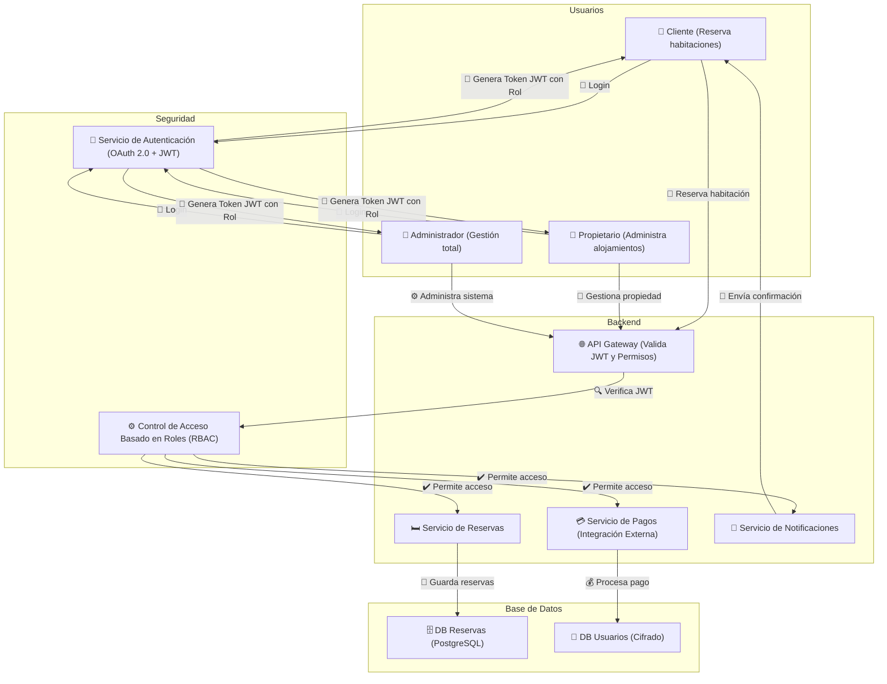

Aquí tienes el diagrama en formato Mermaid cumpliendo con tus especificaciones:  

Este diagrama sigue tu estructura, mostrando los usuarios, la autenticación JWT, el control RBAC, y la interacción con los servicios clave (reservas, pagos, notificaciones). 🚀