Aquí tienes el diagrama en formato Mermaid cumpliendo con tus especificaciones:  

```mermaid
graph TD
  %% Usuarios
  subgraph "Usuarios"
    Cliente["🧑 Cliente (Reserva habitaciones)"]
    Propietario["🏨 Propietario (Administra alojamientos)"]
    Admin["🔧 Administrador (Gestión total)"]
  end

  %% Seguridad y Autenticación
  subgraph "Seguridad"
    AuthService["🔐 Servicio de Autenticación (OAuth 2.0 + JWT)"]
    RBAC["⚙️ Control de Acceso Basado en Roles (RBAC)"]
  end

  %% Backend
  subgraph "Backend"
    APIGateway["🌐 API Gateway (Valida JWT y Permisos)"]
    Reservas["🛏️ Servicio de Reservas"]
    Pagos["💳 Servicio de Pagos (Integración Externa)"]
    Notificaciones["📩 Servicio de Notificaciones"]
  end

  %% Base de Datos
  subgraph "Base de Datos"
    DBReservas["🗄️ DB Reservas (PostgreSQL)"]
    DBUsuarios["🔏 DB Usuarios (Cifrado)"]
  end

  %% Flujo de Autenticación y Seguridad
  Cliente -->|🔑 Login| AuthService
  Propietario -->|🔑 Login| AuthService
  Admin -->|🔑 Login| AuthService

  AuthService -->|📜 Genera Token JWT con Rol| Cliente
  AuthService -->|📜 Genera Token JWT con Rol| Propietario
  AuthService -->|📜 Genera Token JWT con Rol| Admin

  %% Flujo de Autorización y Uso de Servicios
  Cliente -->|📅 Reserva habitación| APIGateway
  Propietario -->|🏨 Gestiona propiedad| APIGateway
  Admin -->|⚙️ Administra sistema| APIGateway

  APIGateway -->|🔍 Verifica JWT| RBAC
  RBAC -->|✔️ Permite acceso| Reservas
  RBAC -->|✔️ Permite acceso| Pagos
  RBAC -->|✔️ Permite acceso| Notificaciones

  %% Base de Datos y Servicios Externos
  Reservas -->|📝 Guarda reservas| DBReservas
  Pagos -->|💰 Procesa pago| DBUsuarios
  Notificaciones -->|📧 Envía confirmación| Cliente
```

Este diagrama sigue tu estructura, mostrando los usuarios, la autenticación JWT, el control RBAC, y la interacción con los servicios clave (reservas, pagos, notificaciones). 🚀