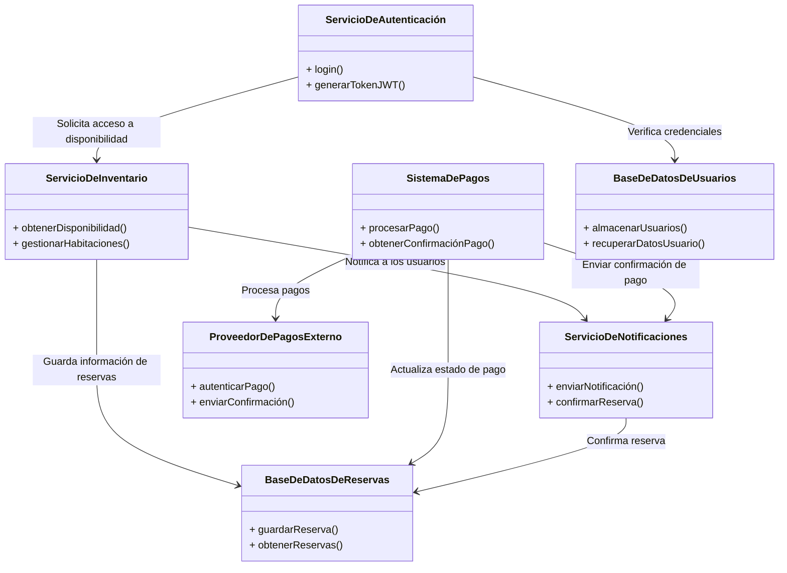

```mermaid
classDiagram
  %% Definición de componentes
  class ServicioDeAutenticación {
    + login()
    + generarTokenJWT()
  }

  class ServicioDeInventario {
    + obtenerDisponibilidad()
    + gestionarHabitaciones()
  }

  class SistemaDePagos {
    + procesarPago()
    + obtenerConfirmaciónPago()
  }

  class ServicioDeNotificaciones {
    + enviarNotificación()
    + confirmarReserva()
  }

  class BaseDeDatosDeUsuarios {
    + almacenarUsuarios()
    + recuperarDatosUsuario()
  }

  class BaseDeDatosDeReservas {
    + guardarReserva()
    + obtenerReservas()
  }

  %% Relaciones entre los componentes
  ServicioDeAutenticación --> BaseDeDatosDeUsuarios : Verifica credenciales
  ServicioDeAutenticación --> ServicioDeInventario : Solicita acceso a disponibilidad
  ServicioDeInventario --> BaseDeDatosDeReservas : Guarda información de reservas
  ServicioDeInventario --> ServicioDeNotificaciones : Notifica a los usuarios
  SistemaDePagos --> BaseDeDatosDeReservas : Actualiza estado de pago
  SistemaDePagos --> ServicioDeNotificaciones : Enviar confirmación de pago
  ServicioDeNotificaciones --> BaseDeDatosDeReservas : Confirma reserva

  %% Dependencias externas
  class ProveedorDePagosExterno {
    + autenticarPago()
    + enviarConfirmación()
  }

  SistemaDePagos --> ProveedorDePagosExterno : Procesa pagos
```