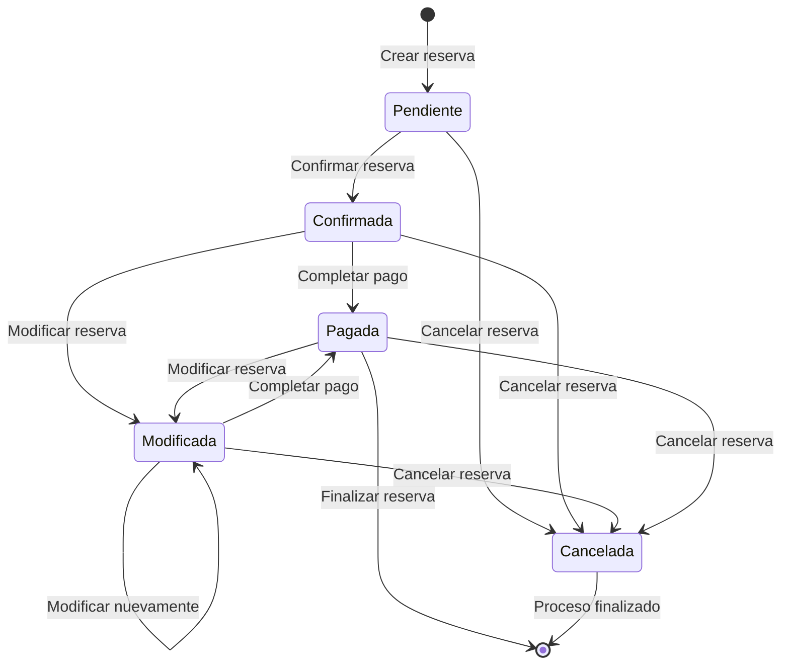

# Diagrama de Transición de Estados: Sistema de Reservas

## Leyenda
- **Pendiente**: La reserva ha sido creada pero no confirmada
- **Confirmada**: La reserva ha sido confirmada por el sistema
- **Pagada**: El cliente ha completado el pago de la reserva
- **Modificada**: La reserva ha sido actualizada por el cliente o el sistema
- **Cancelada**: La reserva ha sido cancelada por el cliente o el sistema
